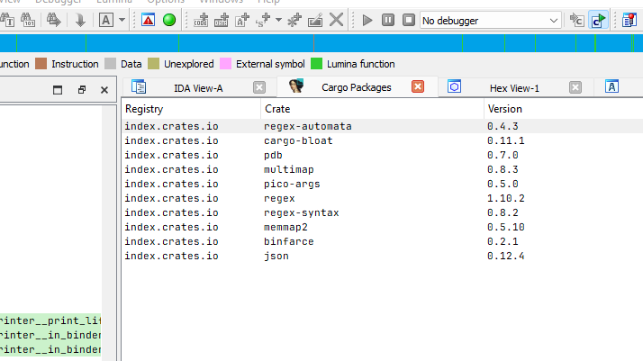

# IDARustCargo

_Example that displays the binary of locally-built [cargo-bloat](https://github.com/RazrFalcon/cargo-bloat) crate._

IDA plugin for displaying potentially installed Cargo dependencies from compiled binary without debug symbols.

This plugin detects Rust [`panic`](https://doc.rust-lang.org/std/macro.panic.html) constant strings in the binary by regex. By the design, this plugin may not display dependencies that do not rely on the code that generates the [`panic`](https://doc.rust-lang.org/std/macro.panic.html), or the binaries that is compiled with [`panic_abort`](https://docs.rs/panic-abort/latest/panic_abort/) crate and/or [`panic_immediate_abort`](https://github.com/rust-lang/rust/blob/25f8d01fd8bda339612d0c0a8844173a09205f7c/library/std/Cargo.toml#L80) std feature, which makes less-constant built-in strings in the resulting binary by making panics and failed asserts immediately abort without formatting any messages.
